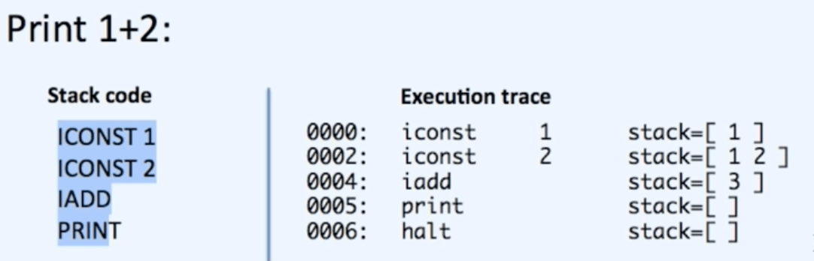
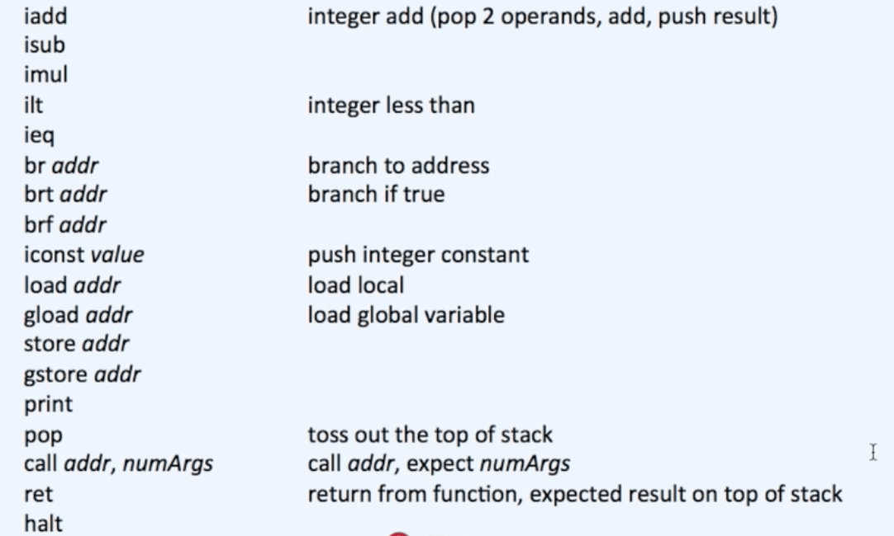

# NOTES

VM/Virtual Machines - for executing high level languages directly to the computer

Takes bytecode instructions and actually translate those down into machine code as it executes them like we're running the native code. VM's like Google's JavaScript VM are fast.

The goal: to simulate a tiny computer

sample for 1+2

- 0000 and 0002: these are memory addresses
- iconst, i add: instruction sets
- why did the memory address jump by +2? Because it depends on the operand. Each operand is a word and in this specific case, 32-bit. A good one to read on https://stackoverflow.com/questions/10576963/why-are-memory-addresses-incremented-by-4-in-mips
- **faster instruction sets**: processors care about characters. so having an "i" in "iadd" instead of just saying "add" matters. the less each of these instructions has to think the **faster it's going to be.** Having a plain "add" instruction, we'd have to tell if whether it's an integer or float and these conversions slow down the compiler as it has to figure it out and then make integer or float instruction sets. It's also a reason why dynamic languages like python are slower as it has to give generic instruction sets where at runtime these would have to be figured ut

instruction sets

- all operations happen on the stack